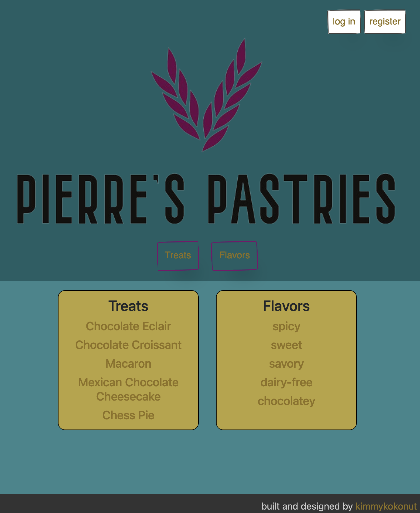
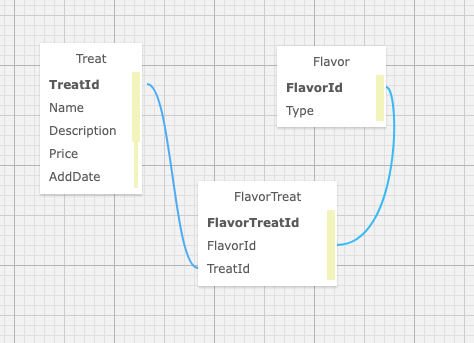

# Pierre's Pastries, take 3

_by Kim Robinson_

## An application with user authentication and many to many relationships with a theme of treats and flavor tags with full CRUD. Color palate is accessibility approved.



###  This app will allow a user to:
    - register, log in and log out of an account
    - have create, delete and update functionality when logged in
    - all users have read functionality
    - see both sides of the many-to-many relationship of Treats & Flavors
    - see a splash page listing all available treats and flavors, which each link to their detail page

### Technologies Used

* C#
* ASP.Net Core Mvc
* Entity Framework Core
* Identity (for Authentication)
* MySql database
* MySql Workbench
* Git
* CSS
* Bootstrap
* HTML Helper methods
* MVC Razor
* ViewBag
* ViewModel



## Setup/Installation Requirements

_Currently not viewable on gh-pages. Please follow steps below to set up locally_

1. Navigate to [my github repository](https://github.com/kimmykokonut/Pierre.Solution) for this project 

2. Click the `Fork` button and  you will be taken to a new page where you can give your repository a new name and description. Choose "create fork".

3. Click the `Code` button and copy the url for HTTPS.

4. On your local computer, create a working directory for my files and name appropriately.

5. On your terminal, type `$ git clone 'url'` (using the url from step 3.)

6. Once you have this on your local directory, if you ever want to push it to GitHub, you need to do these steps first so Git knows to ignore the desired directories and files:
`$ git init` to initialize Git (if cloning, this step already automatically happened)
`$ touch .gitignore` adds .gitignore file in the root directory. 

7. On your terminal, type `$ code .` to open in VS Code.  If you do not have VS Code Editor, you may download [here](https://code.visualstudio.com/)

8. In the .gitignore file, add 
    ```
    bin
    obj
    appsettings.json
    ```
    (SAVE this file if you do not have Auto-Save set up in VSCode).
    In the Terminal:
    ```
    $ git add .gitignore
    $ git commit -m 'add .gitignore'
    $ git push origin main
    ```
(Now these three items will not be seen or pushed to your GitHub remote repository.)
#### You must add and commit this .gitignore BEFORE creating obj, bin or appsetting.json file!

_You can now see all my files, but FIRST it is time for you to set up your database and protect the database connection string with appsettings.json_
------------------------------------------------
## Install and configure MySQL database (MacOS)
_If you already have MySQL installed, you can skip this step_
_If you have Windows 10 or 11, I have the setup info below_

1. [Download](https://dev.mysql.com/downloads/mysql/) the MySQL Community Server .dmg file.  You do not need to log in or sign up, there is a link to just download.  Choose the appropriate operating system that you use.
_You will need the 8.0 version for this to work (current latest version is 8.3)_

2. Follow along with the _Installer_ until you reach _Configuration_ page.
Set the following options:
* use legacy password encryption
* set your password
* click finish.

### Configure your shell's environmental variable.
in your bash command line:
<br/>`$ echo 'export PATH="/usr/local/mysql/bin:$PATH"' >> ~/.bash_profile`
<br/>in zsh:
<br />`$ echo 'export PATH="/usr/local/mysql/bin:$PATH"' >> ~/.zshrc`
* Restart your shell (GitBash/Terminal) to apply changes
* Verify MySQL is installed (entering your personal username/password):
<br />`$ mysql -u[YOUR-USERNAME] -p[YOUR-PASSWORD]`
* If you see an intro message and the command prompts looks like:
`mysql> ` you are good.
* Exit anytime by typing `exit`

## MySQL Workbench (nice to have if you want a visual check of your database, but not required)
1. [Download](https://dev.mysql.com/downloads/workbench/) the MySQL Workbench `.dmg` file.  
_Make sure it is the 8.0 version_ 
2. Install MySQL Workbench to Applications folder
3. Open MySQL Workbench from within the Applications folder
4. Select `Local instance 3306` server. (enter the password you set)
5. Navigate past the Windows stuff to follow directions to import my .sql file....
-----------------------------------------------
## (Windows 10 and 11) Install and configure MySQL database 
1. [Download](https://downloads.mysql.com/archives/get/p/25/file/mysql-installer-web-community-8.0.19.0.msi) MySQL Web Installer (installs both Community Server and Workbench)
2. Install programs. 
* `yes` if prompted to update
* accept license terms
* choose custom setup type
* When prompted to Select Products and Features, choose the following:

    - Check the box that says "Enable the Select Features page to customize product features".
    MySQL Server 8.0.19 or the newest listed version. This will be under "MySQL Servers > MySQL Server > MySQL Server 8.0".
    MySQL Workbench 8.0.19 or the newest listed version. This will be under "Applications > MySQL Workbench > MySQL Workbench 8.0".

    - Select "Next", then "Execute". Wait for download and installation. (This can take a few minutes.)
    - Advance through Configuration as follows:

    * High Availability set to "Standalone".
    "Defaults are OK" under Type and Networking.
    Authentication Method set to Use Legacy Authentication Method.
    * Set password. 
    * Defaults are OK under Windows Service. Make sure that checkboxes are checked for the options "Configure MySQL Server as a Windows Service" and "Start the MySQL Server at System Startup". Under Run Windows Service as..., the "Standard System Account" should be selected.

    - Complete Installation process.
3. Configure System Environment Variables for "Path Variable" so `mysql` command can be recognized in any shell
    - Open the Control Panel: 
        - Select "System and Security", then select "System".
        - Select the option "Change Settings" within the section titled "Computer name, domain, and workgroup settings", and a pop-up window for "System Properties" will display. 

    - Within the "System Properties" pop-up window:
        - Select the "Advanced" tab
        - Then select the "Environment Variables..." button (red circle in image below); this will open a new window called "Environment Variables".

    - Within the "Environment Variables" window, find the section called "System variables" which will have a table listing variable names and their values. In the table, find and double click "Path" under the "variable" column (red square in image below); this will open a new window called "Edit environment variable", listing all environment variables for "Path". 

    - From this window, click "New" (green circle) and add the exact location of your MySQL installation (green square), and click OK (orange circle) to save your changes. Exit out of all of the windows.
    _This location is likely C:\Program Files\MySQL\MySQL Server 8.0\bin, but may differ depending on your specific installation._
4. Confirm both programs are working
    - open Windows PowerShell and type: <br />`$ mysql -u[YOUR-USERNAME] -p[YOUR-PASSWORD]
    (if the command prompt looks like `mysql>`, you are good)
    (you can exit anytime by typing `exit`)
5. Open MySQL Workbench and select `Local instance 3306`, enter your password and take a breath, you're almost there.
----------------------------------------------------
## Set up appsettings.json to include database connection string

* Create a new file named `appsettings.json` and place in the production directory of the project (I will keep this as 'ProjectName' in case you want to rename your project)
`PROJECTNAME.Solution/PROJECTNAME/appsettings.json`

* Add this code to the appsettings.json file, replacing the following values with your own:
    ```
    [YOUR-USERNAME] with your username
    [YOUR-PASSWORD] with your password
    [YOUR-DB-NAME] with the name of your database
    ```
PROJECTNAME.Solution/PROJECTNAME/appsettings.json
```    
{
    "ConnectionStrings": {
        "DefaultConnection": "Server=localhost;Port=3306;database=[YOUR-DB-NAME];uid=[YOUR-USERNAME];pwd=[YOUR-PASSWORD];"
    }
}
```

## ...Back to VSCode's Terminal...
1. While in the terminal, navigate to the project's production directory called "Pierre" and type `$ dotnet build` to compile the application's code and install all needed dependencies (this creates the bin folder).  Type `$ dotnet restore` to create the obj folder.

### Database Migrations
We will use migrations to create a new database based on our code. 
1. Install dotnet ef globally (if not already installed)
`$ dotnet tool install --global dotnet-ef --version 6.0.0`
2. Install the Microsoft.EntityFrameworkCore.Design package in the Production Directory of our application.
`$ dotnet add package Microsoft.EntityFrameworkCore.Design -v 6.0.0`
3.  If you need to make any changes to the Models or their properties, do it now, this next step will create your database based on that data.
4. Create a migration now (and anytime you change your Models) (Initial for your first migration, then a descriptive name for future migrations)
`$ dotnet ef migrations add Initial`
5. Update the database with the migrations.
`$ dotnet ef database update`
6. IF you make a mistake and haven't pushed the changes to GitHub you can revert the last migration
`$ dotnet ef migrations remove`

### Compile/Execute Local Server
- (Terminal) In the working directory, type `$ dotnet run` to compile and execute the server.  It will be available at [localhost5001](https://localhost:5001/) and [localhost5000](https://localhost:5000/)

_Optionally you can use a file watcher so you don't have to restart the server every time the code changes. Run this command `$ dotnet watch run` to make the server automatically update.  <br />If you need to restart the server, you can type `ctrl` + `r`._

- Enjoy!  You can close the development server at anytime by entering `ctrl` + `c` in the terminal.

## Known Bugs
* User's birthday is not entering into db correctly
* Note: I added password override to Program.cs to make development less stressful and commented out the Password Regex on RegisterViewModel to be brought back when in more advanced Test Phasse/Production Mode. I kept it that way to not forget!

## Stretch Goals
* Have separate roles for admins and logged in users (only admin can add, update, delete)
* Add order form accessible to logged in users
* Logged in user can only create, read, update, delete their own orders.
* Greet user by nickname
* Show user dashboard with birthday, image etc.
* Card-ify the content pages
* Fix header to not take so much room vertically and be responsive to screen size
* Figure out styling issue in header. If the login div is in the header div, the 'log out' button loses it's link and is absorbed by the home link attached to the logo, but the login/register buttons work fine. for now, I pulled it into it's own div for functionality.

## License
MIT License. See license.md for further information